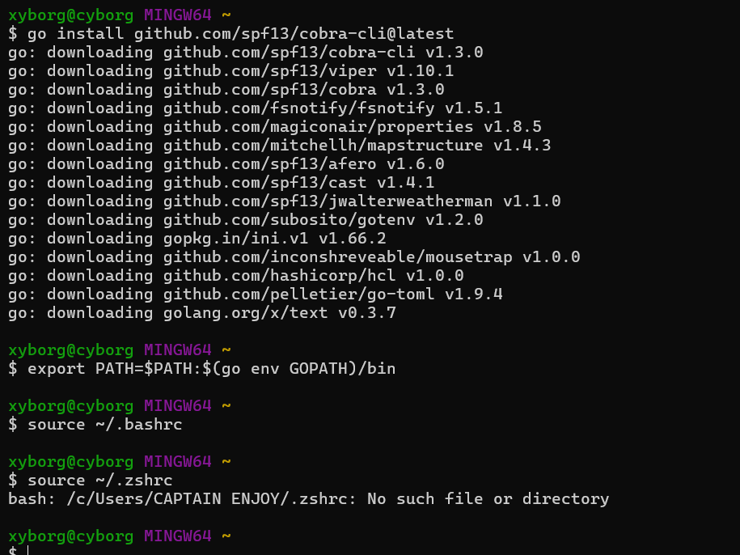
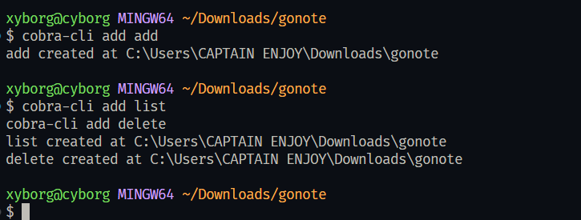
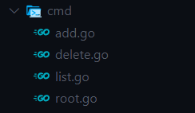

### install cobra cli


### run the root
```bash
go run main.go
```


#### install packages
```bash
go mod init gonote
```
### run this first
```bash
cobra-cli init
```

### add the functions
```bash
cobra-cli add add
cobra-cli add list
cobra-cli add delete
```

This will create;

### In main.go
install `go get -u github.com/spf13/viper`
```go
/*
Copyright © 2025 NAME HERE <EMAIL ADDRESS>
*/
package main

import (
	"gonote/cmd"
	"log"

	"github.com/spf13/viper"
)

func initConfig() {
	viper.SetConfigName("config")
	viper.SetConfigType("yaml")
	viper.AddConfigPath(".")
	if err := viper.ReadInConfig(); err != nil {
		log.Fatalf("Error reading config file: %v", err)
	}
}

func main() {
	cmd.Execute()
}
```

### setup db
Install `go get -u github.com/sqlc-dev/sqlc `

Run `sqlc init` and replac with
```yaml
version: "2"
sql:
  - engine: "postgresql"  # Change this from "mysql" to "postgresql"
    queries: "internal/migrations/queries.sql"  # This file will contain your SQL queries
    schema: "internal/migrations/schema.sql"    # This file will contain your schema (tables)
    gen:
      go:
        package: "store"                       # Go package for the generated code
        out: "internal/store"                   # Output directory for generated Go files
        emit_json_tags: true                    # Optionally, emit JSON tags
        emit_prepared_queries: true             # Emit prepared statements for safety
        emit_empty_slices: true                 # Emit empty slices for collections
```

in internal/migrations/queries
```sql
CREATE TABLE notes (
    id SERIAL PRIMARY KEY,
    title TEXT NOT NULL,
    content TEXT NOT NULL,
    created_at TIMESTAMP DEFAULT now()
);
```

in internal/migrations/schema
```sql
-- name: CreateNote :one
INSERT INTO notes (title, content) VALUES ($1, $2) RETURNING *;

-- name: ListNotes :many
SELECT * FROM notes ORDER BY created_at DESC;

-- name: DeleteNote :exec
DELETE FROM notes WHERE id = $1;

```

Then run the generate
```shell
sqlc generate
```

### Run
```bash
go run main.go category add --name "Work" or ./gonote add category 
go run main.go add --title "Meeting Notes" --content "Gamey" --category 1
go run main.go update --id 1 --content "Updated content"
go run main.go list
go run main.go view --id 1
```

go build -o gonote main.go
```shell
 ./gonote add -n "Linux"  or ./gonote add 
 ./gonote add -t "wa" -x "limbo" -c 1
 ./gonote list
  ./gonote paginate --category "Work" --title "Meeting" --page 1 --pageSize 5
 ```

 $ go build -o gonote main.go